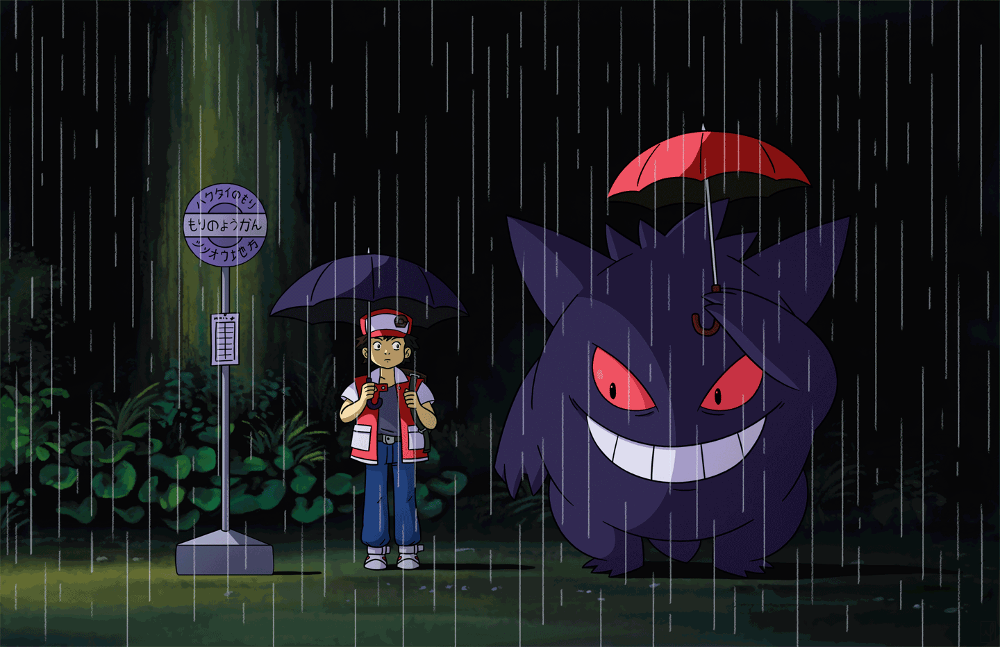

### Olá, Bem vindo ao meu perfil👋

  Me chamo Gabriel Peixto, tenho 24 anos e estou me especializando em Cibersegurança e Frontend. Faço faculdade de Ciência da Computação na Universidade Federal de Roraima (UFRR).

### Skills
                 
 
### Tools
     

### Social Media (Click)

### Gamer (Enthusiast)
  

<picture>
  <source media="(prefers-color-scheme: dark)" srcset="https://github.com/gabiel98/gabiel98/blob/output/github-contribution-grid-snake-dark.svg">
  <source media="(prefers-color-scheme: light)" srcset="https://github.com/gabiel98/gabiel98/blob/output/github-contribution-grid-snake-dark.svg">
  
</picture>

<!-- -->

